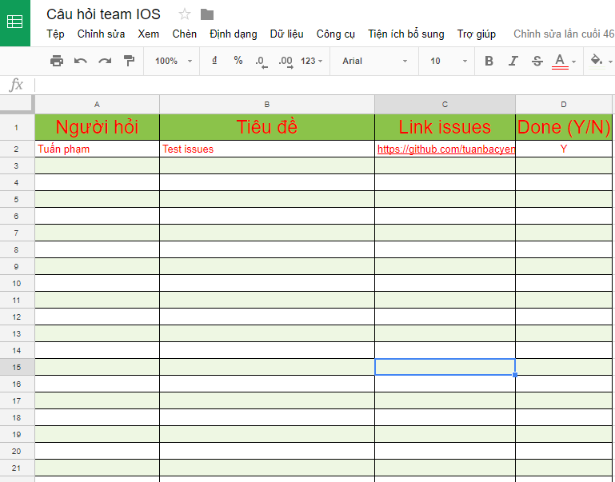

## Trang quản lý câu hỏi (issues) và seminar của Các thành viên team IOS-Android_5Skay

### Mỗi thành viên trong team IOS-Android_5Skay có quyền truy cập vào trang github này để đặt cẩu hỏi cũng như đăng ký seminar trong tháng hoặc vài tháng tiép sau đó. Các câu hỏi sẽ được tem trainning (A Huy, An gầy) hoặc các thành viên trong nhóm trả lời, góp ý. Có thể lúc họp seminar mọi người thường trầm nhưng chắc khi gõ phím online thì chắc có thể thể hiện được hết bản thân. Ngoài ra nếu có nhiều câu hỏi khó thì anh lít đờ Quỳnh (link follow : https://www.facebook.com/quynh.nguyenvan.399) sẽ tham gia trả lời và support.

### Mỗi lần mọi người add câu hỏi thì thêm luôn vào file excel online này để Team Leader quản lý. <a href="https://docs.google.com/spreadsheets/d/13Cyl6XwB7esTG-vJRsv2PEBb7r2vKOklR-d-nVb7VPA/edit?usp=sharing" style="color:blue">Link câu hỏi</a>

### Link seminar đăng ký vào mỗi tuần. <a href="https://docs.google.com" style="color:blue">Link Seminar</a>

### Link quản lý xem serminar vs danh sách câu hỏi không cần login vào driver cho Team lead và Team support. <a href="google.com.vn" style="color:blue">Link Manager</a>

## Chuyên mục post câu hỏi
### Trong thời gian làm dự án có nhiều vướng mắc Thực hiện theo các bước sau
- Tìm hiểu câu hỏi trước khi hỏi. không nên phụ thuộc vào team support
- Khoanh vùng bug hoặc thắc mắc nếu có thể để người hỗ trợ dễ dàng giúp
- Nếu đang ở nhà thì đăng lên issues của mục theo các bước sau.
 

Trong câu hỏi bạn có thể dùng 1 số tag của Html: <a href="https://daringfireball.net/projects/markdown/syntax#html" style="color:blue">Xem ở đây</a>
Các tag được hỗ trợ : h1 h2 h3 h4 h5 h6 h7 h8 br b i strong em a pre code img tt div ins del sup sub p ol ul table thead tbody tfoot blockquote dl dt dd kbd q samp var hr ruby rt rp li tr td th s strike summary details 

#### Sau khi thêm câu hỏi xong hãy nhớ vô file excell để thêm về sau Team lead sẽ quản lý.

#### Tương tự thêm câu trả lời cho đáp án

